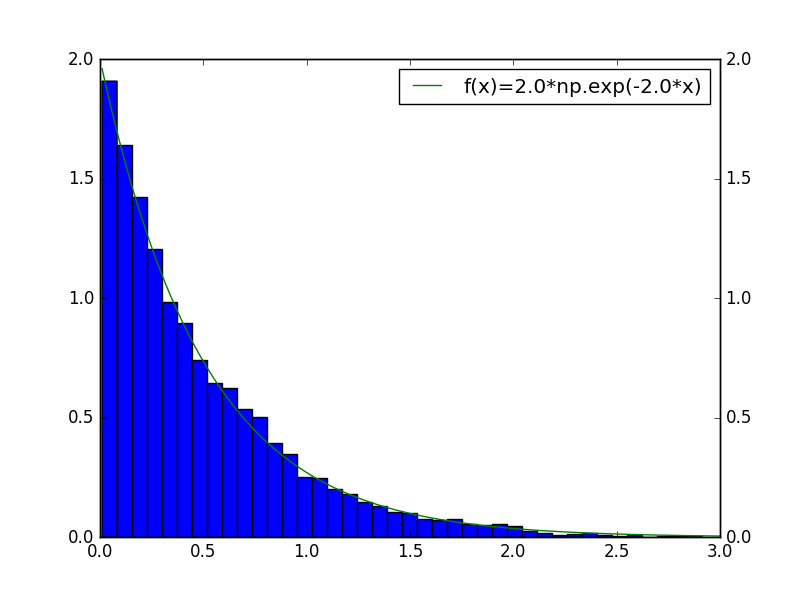
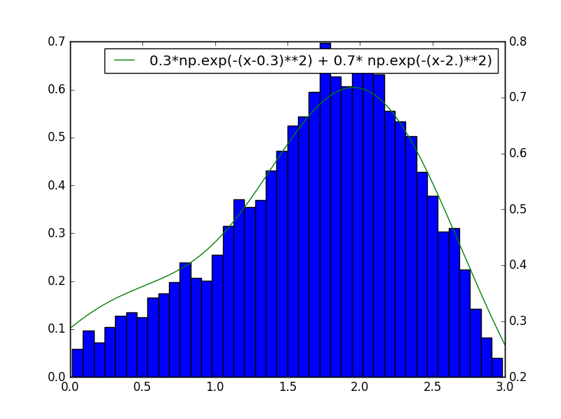
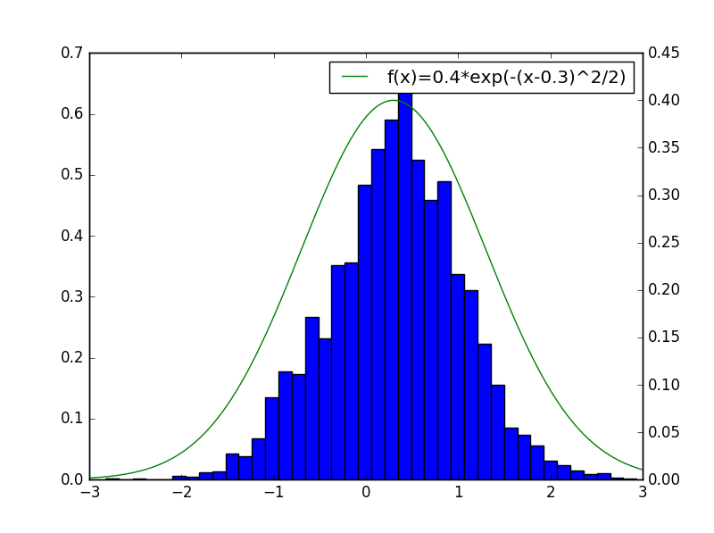
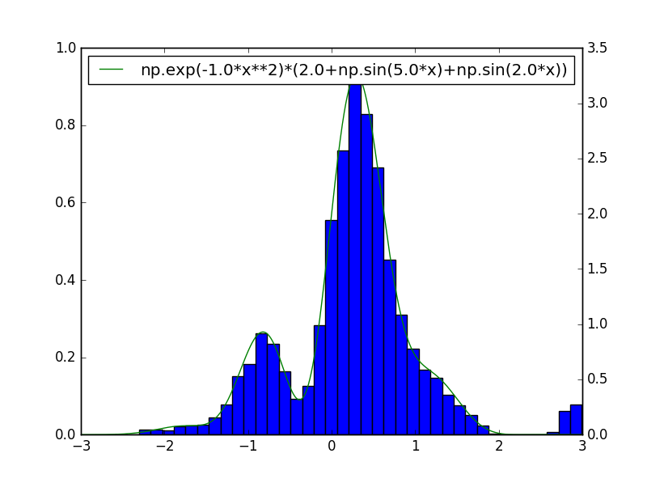

==============
samplepy 1.0.1
==============

**samplepy** implements three sampling methods for univariate distributions. The package includes:

- Importance sampling: **samplepy.Importance**
- Rejection sampling: **samplepy.Rejection**
- Metropolis-Hastings sampling: **samplepy.MH**

Examples:
=========

.. code:: python

 from samplepy import Rejection
 import matplotlib.pyplot as plt
 import numpy as np

 """
 Rejection sampling example from 2 different functions
 """
 # define a unimodal function to sample under
 f = lambda x: 2.0*np.exp(-2.0*x)
 rej = Rejection(f, [0.01, 3.0])  # instantiate Rejection sampling with f and interval
 sample = rej.sample(10000, 1)    # create a sample of 10K points

 x = np.arange(0.01, 3.0, (3.0-0.01)/10000)
 fx = f(x)

 figure, axis = plt.subplots()
 axis.hist(sample, normed=1, bins=40)
 axis2 = axis.twinx()
 axis2.plot(x, fx, 'g', label="f(x)=2.0*exp(-2*x)")
 plt.legend(loc=1)
 plt.show()

Output:
	

Example using rejection sampling for a roughly multi-modal distribution.

.. code:: python

 from samplepy import Rejection
 import matplotlib.pyplot as plt
 import numpy as np
	
 # define a Gaussian-like function to sample under
 f = lambda x: 0.3*np.exp(-(x-0.3)**2) + 0.7* np.exp(-(x-2.)**2)

 rej = Rejection(f, [0.01, 3.0])  # instantiate Rejection sampling with f and interval
 sample = rej.sample(10000, 1)    # create a sample of 10K points

 x = np.arange(0.01, 3.0, (3.0-0.01)/10000)
 fx = f(x)

 figure, axis = plt.subplots()
 axis.hist(sample, normed=1, bins=40)
 axis2 = axis.twinx()
 axis2.plot(x, fx, 'g', label="f(x)=0.3*exp(-(x-0.3)^2) + 0.7*exp(-(x-2.)^2)")
 plt.legend(loc=1)
 plt.show()

Output:
	

	   
Example using Metropolis-Hastings sampling.

.. code:: python

 from samplepy import MH
 import matplotlib.pyplot as plt
 import numpy as np
 
 """
 Metropolis-Hastings sampling with normal proposal dist
 """

 f = lambda x: 0.4*np.exp(-(x-0.3)**2/2.0)

 mh = MH(f, [-3.0, 3.0])
 # sample from MH with a burn-in period of 100 and lag of 1 (optionally set rand seed)
 sample = mh.sample(20000, 100, 1)  # Make sure we have enough points in the sample!

 x = np.arange(-3.0, 3.0, (3.0--3.0)/20000)
 fx = f(x)

 figure, axis = plt.subplots()
 axis.hist(sample, normed=1, bins=40)
 axis2 = axis.twinx()
 axis2.plot(x, fx, 'g', label="f(x)=0.4*exp(-(x-0.3)^2/2)")
 plt.legend(loc=1)
 plt.show()

Output:
	

Example using importance sampling.

.. code:: python

 from samplepy import Importance
 import matplotlib.pyplot as plt
 import numpy as np
 """
 Importance sampling with 5th quantile oversampled from
 """
 f = lambda x: np.exp(-1.0*x**2)*(2.0+np.sin(5.0*x)+np.sin(2.0*x))

 imp = Importance(f, [-3.0, 3.0])
 sample = imp.sample(10000, 0.05, 0.02) # create a sample where 5th quantile is oversampled with a 2% weight

 x = np.arange(-3.0, 3.0, (3.0--3.0)/3000)
 fx = f(x)

 figure, axis = plt.subplots()
 axis.hist(sample, normed=1, bins=40)
 axis2 = axis.twinx()
 axis2.plot(x, fx, 'g', label="f(x)=exp(-x^2)*(2+sin(5x)+sin(2x))")
 plt.legend(loc=1)
 plt.show()

